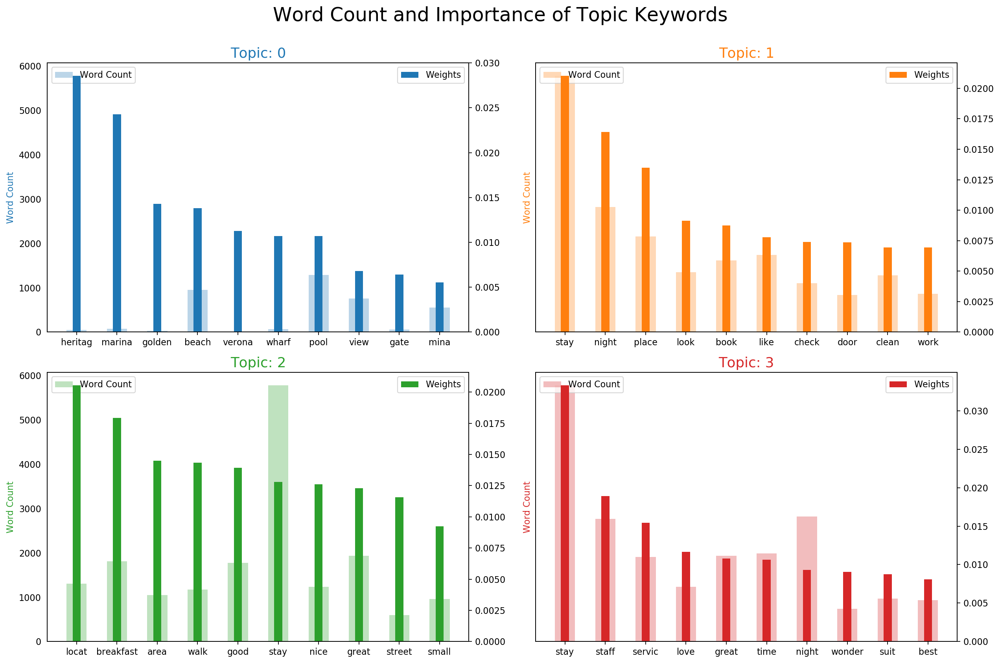

# Topic Modeling with Hotel Reviews

## Objective

This blog is focused to visualize the Topic Modeling feature with the help of LDA (Latent Dirichlet Allocation). Here also, we are going to experiment with this functionality with Trip adviser dataset.

## Data Preprocessing

Due to the huge size of the volume, we have restricted and filtered low rated (<2) & high rated (4.8) reviews, for our analysis. In the end, we have 3939 reviews from different cities.

We have used both predefined and customized stop words for better results and used Snowball stemmer. 

## Latent Dirichlet Allocation

I have created a document-term matrix for LDA model and specified 4 topics for our model. Below are important keywords for each topic.

From the above keyword, we could assign some tentative topics.

- Topic 0 : Review of Tourist places

- Topic 1 : Review about Hostel place

- Topic 2 : Review about food

- Topic 3 : Review about Staff Services
  
  

Now, let dig into the weight of each word with a count of words. Topic 0 mostly weights with Beaches. Also, stay is presented in all other 3 topics with heavy weight. So we should not consider in deciding the topic.

## Distribution of words in each topic

We want to see how many words are distributed in each topic to understand the influence of each topic.

Here black line graph is denoting the whole word count. Topic 0 is presented less than 5 documents and the count is also low. So we can't relay on this topic. But All other topics are having significantly good word count across the reviews.

## Review text color topic

Due to the visual limitation, we have filtered the randomly 10 New Delhi city hotel reviews. Each color is representing the topic of aiding keywords. Mostly, Topic 2 and 3 occupying most of the keywords in this context.

## TSNE - 2 Dimension Topic

Here, we could cover 71 % and below depicted the 2 dimension view fo 4 different topics.

Here except 0 (Tourist places), all are formed as a small cluster in left mid area. It might be inferring that all 3 are interdependent with the hotel environment.

## Conclusion

 We finally get more intuition about what users are talking about. Most of the topics are about Hotel environment and less about tourist places. As well as Topic 0 is not having a majority with the taken dataset. So we can eliminate it and focus on the other 3 topics

